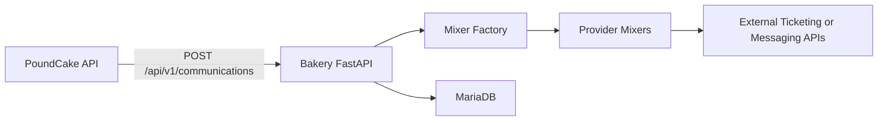

# Bakery

Bakery is PoundCake's communication integration microservice. It is an async broker between PoundCake and external ticketing or messaging systems and exposes Bakery-owned UUID handles (not provider-native IDs) to callers.

## Supported Communication Systems

| Mixer | Key | Actions |
|-------|-----|---------|
| ServiceNow | `servicenow` | create, update, close, comment, search |
| Jira | `jira` | create, update, close, comment, search |
| GitHub Issues | `github` | create, update, close, comment, search |
| PagerDuty | `pagerduty` | create, update, close, comment, search |
| Rackspace Core | `rackspace_core` | create, update, close, comment, search |
| Microsoft Teams | `teams` | create, update, close, comment |
| Discord | `discord` | create, update, close, comment |

## Architecture



### Request Flow

1. PoundCake sends an authenticated `POST /api/v1/communications` (`open`) and receives `communication_id` + `operation_id` immediately (`202 Accepted`).
2. Bakery persists operation state to MariaDB and returns without waiting on provider completion.
3. Bakery worker(s) claim queued operations, execute provider calls, and update operation/communication state with retries + dead-letter behavior.
4. PoundCake polls `GET /api/v1/communications/operations/{operation_id}` until terminal, then reads `GET /api/v1/communications/{communication_id}` as needed.
5. Call `POST /api/v1/communications/{communication_id}/sync` to refresh communication information from the provider (or local cache in dry-run mode).

### Mixers

Mixers are the modular integration layer. Each mixer implements the `BaseMixer` abstract class:

```python
class BaseMixer(ABC):
    async def process_request(self, action: str, data: Dict[str, Any]) -> Dict[str, Any]: ...
    async def validate_credentials(self) -> bool: ...
```

Mixers are registered in `bakery/mixer/factory.py` via the `MIXER_REGISTRY` dict. Adding a new ticketing system means creating a new mixer class and adding it to the registry.
Bakery uses mixers as the single provider abstraction layer.

### Database Tables

| Table | Purpose |
|-------|---------|
| `tickets` | Logical communication records keyed by Bakery UUID |
| `ticket_operations` | Async operation queue + execution status |
| `idempotency_keys` | Idempotent replay mapping for mutation requests |
| `ticket_requests` | Legacy table retained physically for cleanup migration |
| `messages` | Legacy table retained physically for cleanup migration |
| `mixer_configs` | Optional per-mixer dynamic configuration |

## API Endpoints

All endpoints are prefixed with `/api/v1`.

### Health

| Method | Path | Description |
|--------|------|-------------|
| `GET` | `/api/v1/health` | Health check with database connectivity status |

### Communications

Provider-agnostic API:

| Method | Path | Description |
|--------|------|-------------|
| `POST` | `/api/v1/communications` | Queue open operation; returns `communication_id` + `operation_id` |
| `PATCH` | `/api/v1/communications/{communication_id}` | Queue update operation |
| `POST` | `/api/v1/communications/{communication_id}/notifications` | Queue notify/message operation |
| `POST` | `/api/v1/communications/{communication_id}/close` | Queue close operation |
| `GET` | `/api/v1/communications/{communication_id}` | Get logical communication state |
| `POST` | `/api/v1/communications/{communication_id}/sync` | Refresh communication details from provider |
| `GET` | `/api/v1/communications/{communication_id}/operations` | Get operation history |
| `GET` | `/api/v1/communications/operations/{operation_id}` | Get operation status/details |

All non-health endpoints require HMAC auth (`Authorization: HMAC <key_id>:<signature>`, `X-Timestamp`) and mutating endpoints require `Idempotency-Key`.

## Mixer-Specific Request Data

### ServiceNow

**create:**
```json
{
  "title": "Incident title",
  "description": "Incident details",
  "urgency": "3",
  "impact": "3"
}
```

**search:**
```json
{
  "query": "state=1^priority=1",
  "limit": 20,
  "offset": 0,
  "fields": ["number", "short_description", "state"]
}
```

### Jira

**create:**
```json
{
  "project_key": "OPS",
  "title": "Issue summary",
  "description": "Issue details",
  "issue_type": "Task"
}
```

**search:**
```json
{
  "jql": "project = OPS AND status = Open",
  "limit": 20,
  "offset": 0,
  "fields": ["summary", "status", "assignee"]
}
```

### GitHub Issues

**create:**
```json
{
  "owner": "org-name",
  "repo": "repo-name",
  "title": "Issue title",
  "description": "Issue body",
  "labels": ["bug"],
  "assignees": ["username"]
}
```

**search** (full-text):
```json
{
  "owner": "org-name",
  "repo": "repo-name",
  "query": "disk space",
  "state": "open",
  "limit": 20
}
```

**search** (filter):
```json
{
  "owner": "org-name",
  "repo": "repo-name",
  "state": "open",
  "labels": ["bug", "critical"],
  "limit": 20,
  "page": 1
}
```

### PagerDuty

**create:**
```json
{
  "service_id": "PXXXXXX",
  "from_email": "user@example.com",
  "title": "Incident title",
  "description": "Incident details",
  "urgency": "high"
}
```

**search:**
```json
{
  "statuses": ["triggered", "acknowledged"],
  "service_ids": ["PXXXXXX"],
  "since": "2024-01-01T00:00:00Z",
  "until": "2024-01-31T23:59:59Z",
  "limit": 20,
  "offset": 0
}
```

### Rackspace Core

Rackspace Core uses the CTKAPI query endpoint. Authentication is token-based and handled transparently by the mixer.

When PoundCake submits generic create payloads, Bakery renders provider-native BBCode in the mixer and maps fields as follows:
- `subject` <- rendered ticket title
- `body` <- rendered BBCode body
- `account_number` <- `context.provider_config.account_number`
- `queue` <- `context.provider_config.queue` or fallback default from `RACKSPACE_CORE_DEFAULT_QUEUE`
- `subcategory` <- `context.provider_config.subcategory` or fallback default from `RACKSPACE_CORE_DEFAULT_SUBCATEGORY`
- `source` <- `context.provider_config.source` or request `source`

Defaults:
- `RACKSPACE_CORE_DEFAULT_QUEUE=CloudBuilders Support`
- `RACKSPACE_CORE_DEFAULT_SUBCATEGORY=Monitoring`

Safety check:
- For `rackspace_core` create operations, Bakery performs preflight validation.
- If any required field is missing (`account_number`, `queue`, `subcategory`, `subject`, `body`), Bakery logs an explicit error and marks the operation `dead_letter` without retrying.

**create:**
```json
{
  "account_number": "123456",
  "queue": "Support",
  "subcategory": "General",
  "subject": "Ticket subject",
  "body": "Ticket description",
  "source": "Bakery",
  "severity": "Normal"
}
```

**update:**
```json
{
  "ticket_number": "240101-00001",
  "attributes": {
    "severity": "High",
    "queue": "Escalations"
  }
}
```

**close:**
```json
{
  "ticket_number": "240101-00001",
  "status": "Solved"
}
```

**comment:**
```json
{
  "ticket_number": "240101-00001",
  "comment": "Comment text here"
}
```

**search** (direct lookup):
```json
{
  "ticket_number": "240101-00001",
  "attributes": ["ticket_number", "subject", "status", "queue"]
}
```

**search** (where conditions):
```json
{
  "where_conditions": [
    {"field": "queue", "op": "eq", "value": "Support"},
    {"field": "status", "op": "ne", "value": "Solved"}
  ],
  "attributes": ["ticket_number", "subject", "status"]
}
```

**search** (queue view):
```json
{
  "queue_label": "Support"
}
```

## Standardized Alert Payload and Mixer Route Config

PoundCake remains provider-agnostic. Alertmanager payloads should stay descriptive and provider-neutral. Provider-specific routing belongs in the communications route configuration under `context.provider_config`, not in alert labels or annotations.

| Mixer | Required create fields | `context.provider_config` keys |
|------|-------------------------|--------------------------------|
| `rackspace_core` | `account_number`, `queue`, `subcategory`, `subject`, `body` | `account_number`, optional `queue`, optional `subcategory`, optional `source`, optional `visibility` |
| `servicenow` | none beyond generic payload (`title`, `description`) | optional `urgency`, optional `impact` |
| `jira` | `project_key` | `project_key`, optional `issue_type`, optional `transition_id` |
| `github` | `owner`, `repo` | `owner`, `repo`, optional `labels`, optional `assignees` |
| `pagerduty` | `service_id`, `from_email` | `service_id`, `from_email`, optional `urgency` |
| `teams` | none beyond generic payload (`message`) | none |
| `discord` | none beyond generic payload (`message`) | none |

See [docs/alertmanager_payload_template.md](../docs/alertmanager_payload_template.md) for the standardized webhook payload shape and alert-rule annotation template.

Rackspace Core defaults:
- If `queue` is not provided, Bakery uses `RACKSPACE_CORE_DEFAULT_QUEUE` (default `CloudBuilders Support`).
- If `subcategory` is not provided, Bakery uses `RACKSPACE_CORE_DEFAULT_SUBCATEGORY` (default `Monitoring`).

Rackspace Core preflight behavior:
- If required fields are still missing after provider-config/default mapping, Bakery logs the missing field list and marks the operation `dead_letter` without retrying.

Global preflight behavior:
- Bakery validates required fields for the active mixer/action before any outbound provider call.
- If requirements are not met, Bakery writes an explicit validation error to logs and marks the operation `dead_letter` without retrying.

## Response Format

All mixer responses follow a consistent format.

**Single ticket operations** (create, update, close, comment):
```json
{
  "success": true,
  "ticket_id": "3ec48de0-ef52-4c2b-b45c-b58f0ca5c1ef",
  "data": { ... }
}
```

For `update`, `close`, `comment`, and `find`, `request_data.ticket_id` must be this Bakery
internal UUID (not the external ticket number).

**Search operations:**
```json
{
  "success": true,
  "data": {
    "results": [ ... ],
    "count": 10,
    "total": 42
  }
}
```

**Errors:**
```json
{
  "success": false,
  "error": "Description of what went wrong"
}
```

## Configuration

All configuration is via environment variables. In Kubernetes, non-sensitive values are set directly in the deployment spec from `values.yaml`, and all credentials are injected via Kubernetes Secrets.

### Application Settings

| Variable | Default | Description |
|----------|---------|-------------|
| `ENVIRONMENT` | `production` | Environment name (development enables debug) |
| `LOG_LEVEL` | `INFO` | Logging level |
| `DATABASE_HOST` | `bakery-mariadb` | MariaDB hostname |
| `DATABASE_PORT` | `3306` | MariaDB port |
| `DATABASE_USER` | `bakery` | Database username |
| `DATABASE_PASSWORD` | (required) | Database password (from Secret) |
| `DATABASE_NAME` | `bakery` | Database name |
| `MESSAGE_RETENTION_HOURS` | `24` | Hours to keep retrieved messages |
| `MAX_MESSAGES_PER_POLL` | `100` | Max messages returned per poll |
| `MIXER_TIMEOUT_SEC` | `30` | HTTP timeout for mixer API calls |
| `MIXER_MAX_RETRIES` | `3` | Max retry attempts for failed calls |
| `TICKETING_DRY_RUN` | `false` | Log and process requests without sending outbound calls to ticketing systems |

### Mixer Credentials

All credentials are stored in Kubernetes Secrets. Each mixer supports two modes:

1. **Existing Secret** -- reference a pre-created Secret by name via `existingSecret` in values.yaml
2. **Chart-managed Secret** -- provide values directly in values.yaml (chart creates the Secret)

For the supported install flow, prefer installer-managed existing secrets. `./install/install-bakery-helm.sh`
can verify or create provider secrets for Rackspace Core, ServiceNow, Jira, GitHub, PagerDuty, Teams,
and Discord, then wire the corresponding `bakery.<provider>.existingSecret` values automatically.

| Variable | Mixer | Description |
|----------|-------|-------------|
| `SERVICENOW_URL` | ServiceNow | Instance URL |
| `SERVICENOW_USERNAME` | ServiceNow | Username |
| `SERVICENOW_PASSWORD` | ServiceNow | Password (Secret) |
| `JIRA_URL` | Jira | Instance URL |
| `JIRA_USERNAME` | Jira | Username |
| `JIRA_API_TOKEN` | Jira | API token (Secret) |
| `GITHUB_TOKEN` | GitHub | Personal access token (Secret) |
| `PAGERDUTY_API_KEY` | PagerDuty | API key (Secret) |
| `TEAMS_WEBHOOK_URL` | Microsoft Teams | Incoming webhook URL (Secret) |
| `DISCORD_WEBHOOK_URL` | Discord | Incoming webhook URL (Secret) |
| `RACKSPACE_CORE_URL` | Rackspace Core | CTKAPI base URL (default: `https://ws.core.rackspace.com`) |
| `RACKSPACE_CORE_VERIFY_SSL` | Rackspace Core | Verify TLS certificates for CTKAPI calls (`true` by default; set `false` only for controlled testing) |
| `RACKSPACE_CORE_USERNAME` | Rackspace Core | Username |
| `RACKSPACE_CORE_PASSWORD` | Rackspace Core | Password (Secret) |
| `RACKSPACE_CORE_DEFAULT_QUEUE` | Rackspace Core | Default queue used when route `provider_config.queue` is not provided (default: `CloudBuilders Support`) |
| `RACKSPACE_CORE_DEFAULT_SUBCATEGORY` | Rackspace Core | Default subcategory used when route `provider_config.subcategory` is not provided (default: `Monitoring`) |

## Deployment

### Helm

Bakery is deployed as part of the PoundCake Helm chart. Enable it in `values.yaml`:

```yaml
bakery:
  enabled: true
  config:
    ticketingDryRun: false
```

The chart creates:
- **Deployment** with health/readiness probes
- **Service** (ClusterIP on port 8000)
- **Secret** for mixer credentials
- **MariaDB** instance (via MariaDB Operator) with database, user, and grants
- **Job** for database initialization (runs migrations on install/upgrade)

Optional: expose Bakery through Gateway API (for cross-environment PoundCake -> Bakery traffic):

```yaml
bakery:
  gateway:
    enabled: true
    gatewayName: flex-gateway
    gatewayNamespace: envoy-gateway
    listener:
      name: bakery-https
      hostname: bakery.api.ord.cloudmunchers.net
      port: 443
      protocol: HTTPS
      tlsSecretName: bakery-gw-tls-secret
      allowedNamespaces: All
      updateIfExists: true
    hostnames:
      - bakery.api.ord.cloudmunchers.net
```

When `bakery.gateway.enabled=true`, the chart also creates:
- Gateway listener reconciliation hook job
- Bakery HTTPRoute (`bakery-httproute`)
- Cluster-scoped RBAC for Gateway API objects

### Docker Image

The image is built via GitHub Actions and pushed to:

```
ghcr.io/rackerlabs/poundcake-bakery
```

Bakery is built from the root multi-target Dockerfile:
1. **`python-builder-base`** -- shared Python build dependencies and venv creation
2. **`bakery-deps`** -- Bakery runtime dependencies from `bakery/requirements.txt`
3. **`bakery-runtime`** -- Bakery-only runtime image contents

The final image contains no git history, tests, documentation, or development dependencies.

### Local Development

```bash
# From repo root
cd bakery

# Install dependencies
pip install -r requirements.txt

# Set required environment variables
export DATABASE_HOST=localhost
export DATABASE_PORT=3306
export DATABASE_USER=bakery
export DATABASE_PASSWORD=bakery
export DATABASE_NAME=bakery

# Run the application
python -m bakery.main
```

The application starts on `http://localhost:8000` with auto-reload enabled when `ENVIRONMENT=development`.

## Project Structure

```
bakery/
├── requirements.txt        # Runtime Python dependencies
├── __init__.py             # Version re-export
├── main.py                 # FastAPI application entry point
├── config.py               # Environment variable configuration
├── database.py             # SQLAlchemy engine and session management
├── db_init.py              # Database initialization + Alembic upgrade runner (K8s Job)
├── models.py               # SQLAlchemy models (Message, TicketRequest, MixerConfig)
├── schemas.py              # Pydantic request/response schemas
├── alembic.ini             # Alembic migration configuration
├── alembic/
│   ├── env.py              # Alembic environment
│   ├── script.py.mako      # Migration template
│   └── versions/
│       └── 001_initial_schema.py
├── api/
│   ├── __init__.py
│   ├── health.py           # GET /health
│   ├── communications.py   # Public /communications API surface
│   └── tickets.py          # Internal ticket operation helpers reused by communications
└── mixer/
    ├── __init__.py
    ├── base.py             # BaseMixer ABC
    ├── factory.py          # MIXER_REGISTRY, get_mixer(), list_mixers()
    ├── servicenow.py       # ServiceNowMixer
    ├── jira.py             # JiraMixer
    ├── github.py           # GitHubMixer
    ├── pagerduty.py        # PagerDutyMixer
    ├── teams.py            # TeamsMixer
    ├── discord.py          # DiscordMixer
    └── rackspace_core.py   # RackspaceCoreMixer (CTKAPI)
```

## Database Ownership and Migrations

Bakery always owns its own database schema and migration history:
- Bakery migrations live under `bakery/alembic/` and are applied by the Bakery init job.
- API migrations live under `alembic/` and must not be used for Bakery tables.

When deployed alongside PoundCake:
- You may point both services at the same MariaDB server endpoint.
- You must keep separate DB names and users/credentials (`poundcake` vs `bakery`).
