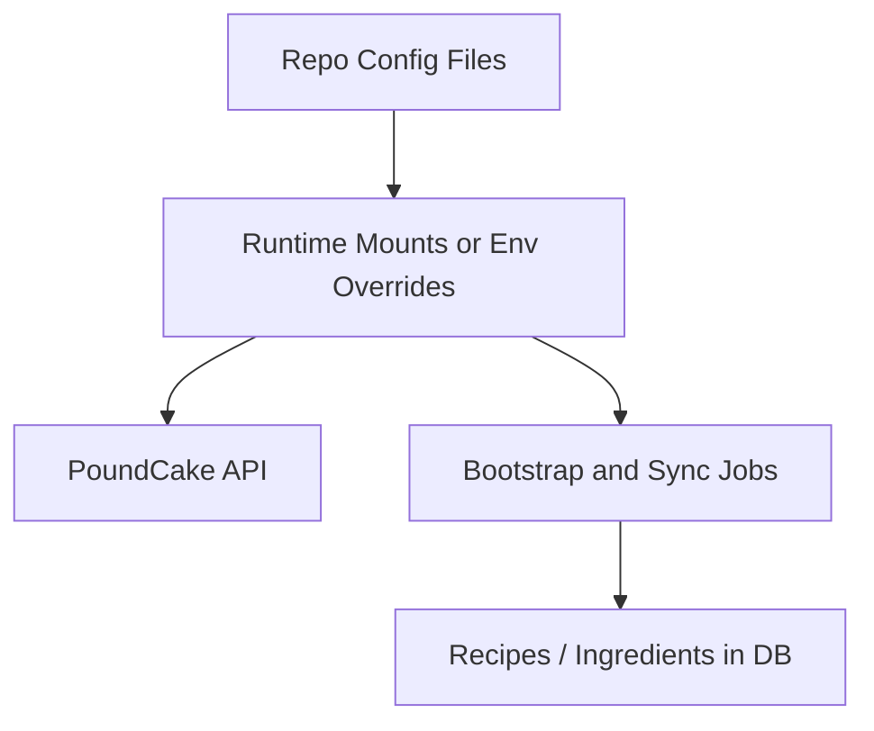

# Runtime Config

## Config Flow



## st2_api_key

This file contains the StackStorm API key used by PoundCake.

- Location (containers): `/app/config/st2_api_key`
- Generated by: `st2client` on startup

If the key is invalid:

```bash
rm -f config/st2_api_key
docker compose restart st2client
```

## bootstrap/ingredients/bakery.yaml

Versioned bootstrap ingredient catalog loaded by `/api/v1/cook/sync` when called with
`mark_bootstrap=true`.

- Default runtime path: `/app/bootstrap/ingredients/bakery.yaml`
- Override with env var: `POUNDCAKE_BOOTSTRAP_INGREDIENTS_FILE`
- Schema:
  - `apiVersion: poundcake/v1`
  - `kind: IngredientCatalog`
  - `ingredients: []`

## bootstrap/recipes/*.yaml

Versioned bootstrap recipe catalog entries loaded by `/api/v1/cook/sync` when called with
`mark_bootstrap=true`.

- Source-controlled directory: `config/bootstrap/recipes`
- Runtime default directory: `/app/bootstrap/recipes`
- Override with env var: `POUNDCAKE_BOOTSTRAP_RECIPES_DIR`
- Schema (per file):
  - `apiVersion: poundcake/v1`
  - `kind: RecipeCatalogEntry`
  - `recipe: { name, description, enabled, recipe_ingredients[] }`

Generate from temp rules:

```bash
./.venv/bin/python scripts/generate_bootstrap_recipes_from_rules.py
```
