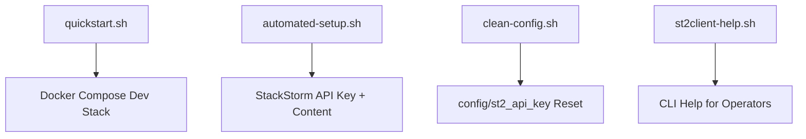

# Docker Scripts

## Script Roles

## automated-setup.sh

Runs inside `st2client` to generate and validate a StackStorm API key and register content.

## clean-config.sh

Removes `config/st2_api_key` so `st2client` regenerates it.

## quickstart.sh

Local helper for bootstrapping a Docker Compose dev environment.

## st2client-help.sh

Helper commands for StackStorm CLI usage.
