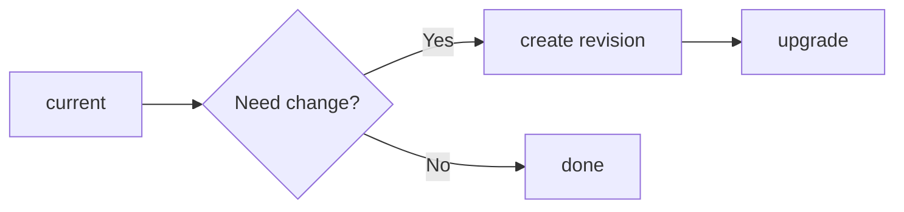

# Alembic Quick Reference

## Command Flow



```bash
# Current version
python scripts/migrate.py current

# Apply migrations
python scripts/migrate.py upgrade

# Create new migration
python scripts/migrate.py create "description"
```

Naming conventions:
- `expected_duration_sec`
- `timeout_duration_sec`
