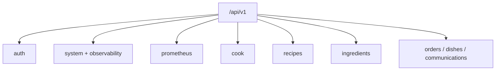

# API Endpoints

This document reflects the current PoundCake API surface.

## Endpoint Groups

## Base
- `GET /`
- `GET /metrics`

## Versioned API (prefix: `/api/v1`)

### Auth
- `GET /auth/providers`
- `POST /auth/login`
- `GET /auth/me`
- `POST /auth/logout`
- `GET /auth/oidc/login`
- `GET /auth/oidc/callback`
- `POST /auth/device/start`
- `POST /auth/device/poll`
- `GET /auth/principals`
- `GET /auth/bindings`
- `POST /auth/bindings`
- `PATCH /auth/bindings/{binding_id}`
- `DELETE /auth/bindings/{binding_id}`

### System & Monitoring
- `GET /live`
- `GET /ready`
- `GET /health`
- `GET /stats`
- `GET /settings`
- `GET /observability/overview`

### Prometheus
- `GET /prometheus/rules`
- `GET /prometheus/rule-groups`
- `GET /prometheus/metrics`
- `GET /prometheus/labels`
- `GET /prometheus/label-values/{label_name}`
- `GET /prometheus/health`
- `POST /prometheus/reload`
- `POST /prometheus/rules`
- `PUT /prometheus/rules/{rule_name}`
- `DELETE /prometheus/rules/{rule_name}`

### Cook (Execution + StackStorm)
- `POST /cook/execute`
  - request fields: `execution_engine`, `execution_target`, optional `execution_payload`, optional `execution_parameters`, `retry_count`, `retry_delay`, `timeout_duration_sec`, `context`
  - generic execution endpoint for supported engines (`stackstorm`, `bakery`)
  - canonical response fields: `engine`, `status`, `execution_ref`, `error_message`, `result`, `raw`, `attempts`
- `GET /cook/executions/{execution_id}`
- `GET /cook/executions`
- `GET /cook/executions/{execution_id}/tasks`
- `PUT /cook/executions/{execution_id}` (cancel)
- `DELETE /cook/executions/{execution_id}` (delete record)
- `POST /cook/workflows/register`
- `POST /cook/sync`
- `GET /cook/packs` (canonical pack-sync tar.gz endpoint)

### Recipes
- `POST /recipes/`
- `GET /recipes/`
- `GET /recipes/{recipe_id}`
- `GET /recipes/by-name/{recipe_name}`
- `PUT /recipes/{recipe_id}`
- `PATCH /recipes/{recipe_id}`
- `DELETE /recipes/{recipe_id}`

### Ingredients
- `POST /ingredients/`
- `GET /ingredients/`
- `GET /ingredients/{ingredient_id}`
- `PUT /ingredients/{ingredient_id}`
- `PATCH /ingredients/{ingredient_id}`
- `DELETE /ingredients/{ingredient_id}`
- `GET /ingredients/by-name/{recipe_name}`
- `GET /ingredients/by-recipe/{recipe_id}`

Ingredient payload contract:
- `execution_payload` is `object | null`
- when `execution_engine=bakery` and `execution_purpose=comms`, `execution_payload.template` must be an object
- canonical Bakery comms `execution_target` values are: `core`, `jira`
- Bakery comms requires `execution_parameters.operation` in:
  `ticket_create`, `ticket_update`, `ticket_comment`, `ticket_close`
- `execution_id` and `execution_purpose` are canonical fields
- `action_id` and `ingredient_kind` are accepted/returned as deprecated aliases

Bootstrap catalog contract:
- bootstrap sync reads `POUNDCAKE_BOOTSTRAP_INGREDIENTS_FILE` (default: `/app/bootstrap/ingredients/bakery.yaml`)
- bootstrap sync reads `POUNDCAKE_BOOTSTRAP_RECIPES_DIR` (default: `/app/bootstrap/recipes`)
- catalog schema:
  - `apiVersion: poundcake/v1`
  - `kind: IngredientCatalog`
  - `ingredients: []`
- recipe catalog entry schema (per file):
  - `apiVersion: poundcake/v1`
  - `kind: RecipeCatalogEntry`
  - `recipe: { name, description, enabled, recipe_ingredients[] }`
- `/cook/sync` response includes:
  - `bootstrap_catalog.ingredients` stats (`created`, `updated`, `skipped`, `errors`)
  - `bootstrap_catalog.recipes` stats (`created`, `updated`, `skipped`, `processed`, `errors`)

### Orders
- `GET /orders`
- `POST /orders`
- `GET /orders/{order_id}`
- `GET /orders/{order_id}/timeline`
- `POST /orders/{order_id}/dispatch`
- `PUT /orders/{order_id}`

### Dishes
- `GET /dishes`
- `POST /dishes/{dish_id}/claim`
- `PUT /dishes/{dish_id}`
- `PATCH /dishes/{dish_id}`
- `GET /dishes/{dish_id}/ingredients`
- `POST /dishes/{dish_id}/ingredients/bulk`

### Webhook
- `POST /webhook`

### Suppressions
- `GET /suppressions`
- `POST /suppressions`
- `GET /suppressions/{suppression_id}`
- `PATCH /suppressions/{suppression_id}`
- `POST /suppressions/{suppression_id}/cancel`
- `GET /suppressions/{suppression_id}/stats`
- `GET /activity/suppressed`
- `POST /suppressions/run-lifecycle` (internal worker trigger)

### Ticketing / Bakery
- `GET /ticketing/bakery`

## Debug (only when `settings.debug=true`)
- `GET /docs`
- `GET /redoc`
- `GET /openapi.json`
