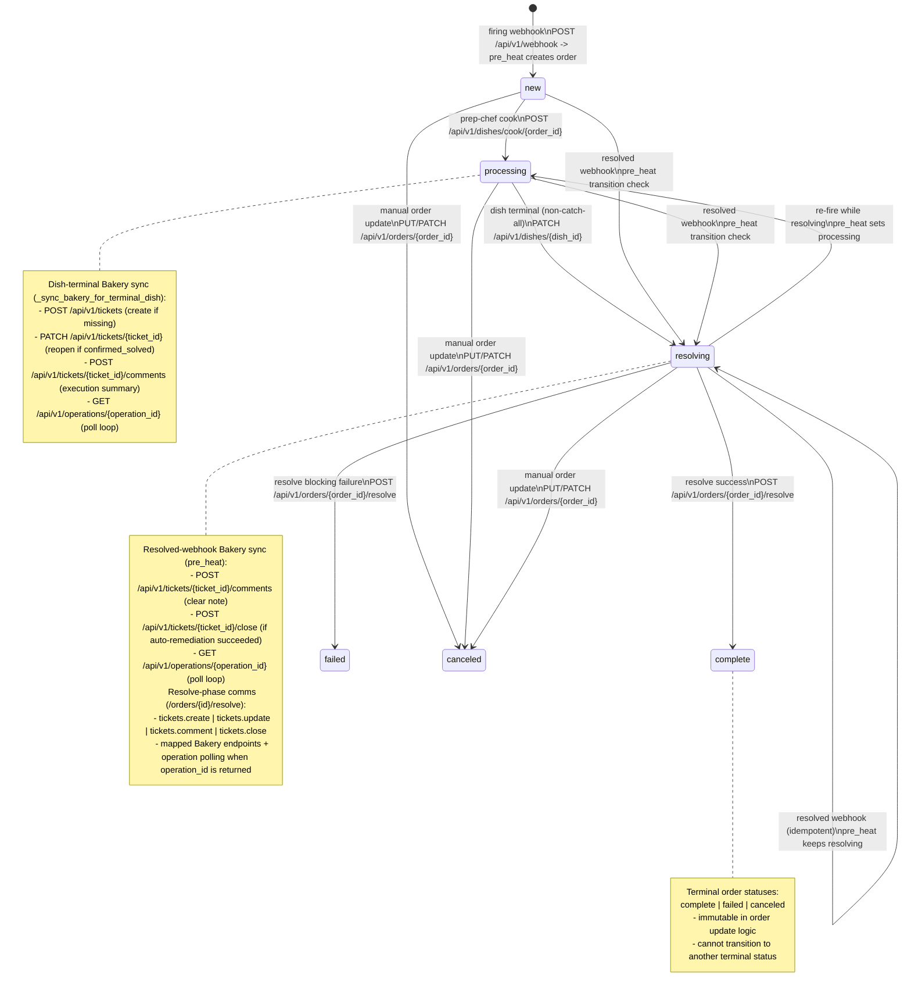

# Architecture

## Summary

PoundCake is a stateless FastAPI service with background workers. The API accepts webhooks, stores orders in MariaDB, and workers orchestrate ingredient execution per dish across supported engines.

## Key Services

- **API**: Intake, CRUD, unified execution orchestration, and DB access.
- **Prep Chef**: Converts new orders into dishes.
- **Chef**: Claims dishes and triggers StackStorm workflows.
- **Timer**: Monitors workflow executions and persists results.
- **Dishwasher**: Syncs StackStorm actions/packs into Ingredients/Recipes.

## Data Model (Core)

- `orders`: Alert intake and processing status.
- `recipes`: Workflow templates and metadata.
- `ingredients`: StackStorm actions + default parameters.
- `recipe_ingredients`: Ordered list of ingredients per recipe.
- `dishes`: Execution instance of a recipe for an order.
- `dish_ingredients`: Per-task execution results and timestamps.

## Execution Flow

1. Alertmanager POSTs `/api/v1/webhook`.
2. `prep-chef` claims orders and calls `/api/v1/dishes/cook/{order_id}`.
3. `chef` claims dishes, registers the workflow, and executes it via `/api/v1/cook/execute` (`execution_engine=stackstorm`).
4. `timer` polls StackStorm and updates `dishes` and `dish_ingredients`.
5. `dishwasher` syncs StackStorm actions/packs into the database.

## Order Workflow Graph (States + Bakery Calls)

