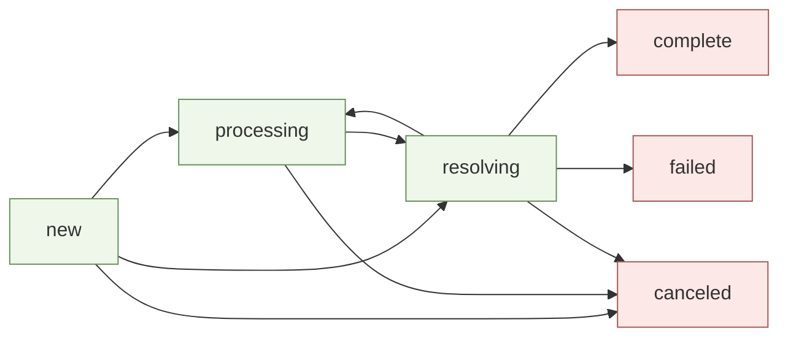

# Architecture

## Summary

PoundCake is a stateless FastAPI service with background workers. The API accepts webhooks, stores orders in MariaDB, and workers orchestrate ingredient execution per dish across supported engines.

## Key Services

- **API**: Intake, CRUD, unified execution orchestration, and DB access.
- **Prep Chef**: Converts new orders into dishes.
- **Chef**: Claims dishes and triggers StackStorm workflows.
- **Timer**: Monitors workflow executions and persists results.
- **Dishwasher**: Syncs StackStorm actions/packs into Ingredients/Recipes.

## Data Model (Core)

- `orders`: Alert intake and processing status.
- `recipes`: Workflow templates and metadata.
- `ingredients`: StackStorm actions + default parameters.
- `recipe_ingredients`: Ordered list of ingredients per recipe.
- `dishes`: Execution instance of a recipe for an order.
- `dish_ingredients`: Per-task execution results and timestamps.

## Execution Flow

1. Alertmanager POSTs `/api/v1/webhook`.
2. `pre_heat()` creates or updates the `orders` row and moves resolved alerts into `processing_status="resolving"` when eligible.
3. `prep-chef` claims dispatchable orders and calls `/api/v1/orders/{order_id}/dispatch`.
4. `chef` claims dishes, executes Bakery segments directly, and starts StackStorm workflow segments through `/api/v1/cook/execute`.
5. `timer` finalizes StackStorm-backed dishes and can recover/finish pending Bakery-only segments when no workflow execution id exists.
5. `dishwasher` syncs StackStorm actions/packs into the database.

## Unified Dispatch Order Diagram

```mermaid
flowchart LR
  classDef api fill:#eef6ff,stroke:#5b7ea3;
  classDef worker fill:#eef7ea,stroke:#6b8f5e;
  classDef state fill:#fdf6e3,stroke:#657b83;

  Firing["firing webhook"] --> Preheat["pre heat"]
  Resolved["resolved webhook"] --> Preheat

  subgraph Dispatch
    Preheat --> Queue["dispatchable order"]
    Prep["prep chef"] --> Queue
    Queue --> Phase{"run phase"}
    Phase --> FireDish["firing dish"]
    Phase --> ResolveDish["resolving dish"]
  end

  subgraph Execution
    FireDish --> Claim["chef claims dish"]
    ResolveDish --> Claim
    Claim --> Stackstorm{"stackstorm rows"}
    Stackstorm -->|yes| ST2["run stackstorm"]
    Stackstorm -->|no| Bakery{"bakery rows"}
    ST2 --> Timer["timer writes results"]
    Timer --> Bakery
    Bakery -->|yes| Bake["run bakery rows"]
    Bakery -->|no| Final["finalize dish"]
    Bake --> Final
  end

  Final --> Outcome{"dish phase"}
  Outcome -->|firing| OrderUpdate["update active order"]
  Outcome -->|resolving| OrderClose["complete or fail order"]

  class Preheat,Claim,ST2,Timer,Bake api;
  class Prep worker;
  class Queue,FireDish,ResolveDish,Final,OrderUpdate,OrderClose state;
```

## Order Workflow Graph (States + Bakery Calls)

## Webhook Alert Flow (Functions + State Changes)

### 1. Webhook intake

- `alertmanager_webhook()` in `/api/api/webhook.py` receives `POST /api/v1/webhook`
- It calls `pre_heat(payload_dict, db, req_id)` in `/api/services/pre_heat.py`

### 2. `pre_heat()` order handling

- Firing alert with no active order:
  - creates `Order(processing_status="new", alert_status="firing", is_active=True, remediation_outcome="pending")`
- Firing alert with an active order:
  - increments `counter`
  - if the order was `resolving`, resets `processing_status` back to `new`
- Resolved alert:
  - finds the active order, or latest non-resolved order for the fingerprint
  - sets `alert_status="resolved"`
  - if `can_transition_to_resolving(existing.processing_status, "alert_resolved")` is true, sets `processing_status="resolving"`
  - sets `is_active=False` only when the resulting order state is terminal

### 3. `prep_loop()` dispatch handoff

- `prep_loop()` in `/kitchen/prep_chef.py` polls `/orders` for:
  - `new`
  - `escalation`
  - `resolving`
  - `waiting_clear`
- It dispatches each eligible order via `dispatch_order()` in `/api/api/orders.py`

### 4. `dispatch_order()` run-phase selection

- `new` -> `run_phase="firing"`
- `escalation` -> `run_phase="escalation"`
- `resolving` -> `run_phase="resolving"`
- `waiting_clear`:
  - if `alert_status=="resolved"`, promotes order to `resolving`
  - if `clear_deadline_at` expired and `clear_timed_out_at is None`, sets `clear_timed_out_at`, clears auto-close, and moves order to `escalation`
  - otherwise returns `status="skipped"`

### 5. Dispatch-time order state changes

- No recipe, firing phase:
  - `processing_status="waiting_clear"`
  - `remediation_outcome="none"`
  - clears timeout and auto-close fields
- No recipe, non-firing phase:
  - `processing_status="waiting_clear"`
- Recipe found, firing phase:
  - `processing_status="processing"`
  - if remediation exists, `remediation_outcome="pending"`
  - otherwise `remediation_outcome="none"`
- Recipe found, escalation/resolving phase:
  - order remains in that phase until dish finalization

### 6. Dish creation and seeding

- `dispatch_order()` creates or reuses `Dish(processing_status="new", run_phase=<phase>)`
- `seed_dish_ingredients_for_phase()` in `/api/services/dish_planner.py` seeds the step rows
- Bakery comms rows are materialized at dispatch by:
  - `build_step_execution_payload()`
  - `build_canonical_communication_context()`

### 7. `run_chef()` execution

- `run_chef()` in `/kitchen/chef.py` claims dishes through `claim_dish()` in `/api/api/dishes.py`
- Dish claim transition:
  - `new -> processing`
- `next_pending_execution_segment()` in `/kitchen/execution_segments.py` picks the next contiguous engine segment:
  - `bakery`
  - `stackstorm`
- Bakery path:
  - `_execute_bakery_steps()` executes each comms ingredient and finalizes the dish immediately when no StackStorm segment remains
- StackStorm path:
  - `_start_stackstorm_workflow()` registers and launches the workflow
  - timer later finalizes the dish

## PoundCake -> Bakery Call Chain

### 1. Bakery segment execution

- Chef uses `_execute_bakery_steps()` in `/kitchen/chef.py`
- Timer recovery uses `_execute_pending_bakery_ingredients()` in `/kitchen/timer.py`
- Each Bakery dish ingredient:
  - is upserted to `execution_status="running"`
  - calls `POST /api/v1/cook/execute`

### 2. Unified execute path

- `execute_ingredient()` in `/api/api/cook.py`
- For Bakery it:
  - resolves the template via `resolve_bakery_payload()`
  - determines destination and operation
  - calls `prepare_communication_context()` when `order_id` is present
  - injects `_canonical` via `build_canonical_communication_context()`
  - hands off to the orchestrator with `ExecutionContext`

### 3. Route preparation

- `prepare_communication_context()` in `/api/services/order_communications.py`
- Calls:
  - `ensure_order_communication()`
  - `refresh_remote_state()`
  - optionally `find_reusable_communication()`
- Route state before execution:
  - new/reset route -> `lifecycle_state="pending"`
  - reused route -> `lifecycle_state="reused"`
  - `writable` and `reopenable` come from `determine_writeability()`

### 4. PoundCake Bakery adapter

- `BakeryExecutionAdapter.execute_once()` in `/api/services/execution_adapters/bakery.py`
- Canonical operation mapping:
  - `open` -> `create_ticket_with_key()` or reopen/comment existing ticket
  - `update` -> `update_ticket_with_key()`
  - `notify` -> `add_ticket_comment_with_key()`
  - `close` -> `close_ticket_with_key()`
- Polling path:
  - accepted response may include `operation_id`
  - terminal result fetched via `poll_operation()`
- Adapter result:
  - successful terminal payload -> `ExecutionResult(status="succeeded")`
  - unsuccessful terminal payload -> `ExecutionResult(status="failed")`

### 5. PoundCake client -> Bakery API -> Bakery worker

- PoundCake client methods in `/api/services/bakery_client.py`:
  - `open_communication_with_key()`
  - `update_communication_with_key()`
  - `notify_communication_with_key()`
  - `close_communication_with_key()`
  - wrappers `create_ticket_with_key()`, `update_ticket_with_key()`, `add_ticket_comment_with_key()`, `close_ticket_with_key()`
- Bakery API endpoints in `/bakery/api/communications.py`:
  - `open_communication()`
  - `update_communication()`
  - `notify_communication()`
  - `close_communication()`
  - `get_communication_operation()`
- Bakery ticketing layer delegates to:
  - `create_ticket()`
  - `update_ticket()`
  - `add_comment()`
  - `close_ticket()`
- Bakery worker renders provider-native payloads via:
  - `_build_provider_payload()` in `/bakery/worker.py`
  - `render_provider_content()`
  - `provider_config_from_context()`

## Terminal State Reference

### Order terminal states

- `complete`
- `failed`
- `canceled`

### Dish terminal states

- `complete`
- `failed`
- `abandoned`
- `timeout`
- `canceled`

### Order processing transitions

- webhook create:
  - `none -> new`
- firing dispatch with recipe:
  - `new -> processing`
- firing dispatch with no recipe:
  - `new -> waiting_clear`
- resolved webhook:
  - `new|processing|waiting_clear|escalation|resolving -> resolving`
- firing dish terminal in `update_dish()`:
  - remediation `none` -> `waiting_clear`
  - dish `complete` -> `waiting_clear` and `remediation_outcome="succeeded"`
  - dish `failed` -> `escalation` and `remediation_outcome="failed"`
- escalation dish terminal:
  - `escalation -> waiting_clear`
- resolving dish terminal:
  - resolve dish `complete` -> order `complete`, `is_active=False`
  - resolve dish failure -> order `failed`, `is_active=False`

### Dish processing transitions

- dispatch creates dish:
  - `new`
- chef claim:
  - `new -> processing`
- timer segment handoff:
  - `processing|finalizing -> new` via `_requeue_dish_for_next_segment()`
- bakery-only finalization:
  - `processing -> complete|failed`
- StackStorm finalization:
  - `processing|finalizing -> complete|failed`
  - may also end as `abandoned|timeout|canceled`

### Order communication route state

- route creation:
  - `lifecycle_state="pending"`
- reused route:
  - `lifecycle_state="reused"`
- after `apply_execution_result()`:
  - `lifecycle_state=<execution result status>` usually `succeeded` or `failed`
  - `bakery_ticket_id` may be populated from `context_updates["bakery_ticket_id"]`
  - `bakery_operation_id` is set from `execution_ref`
  - `remote_state` comes from Bakery result payload or `get_communication()`
  - `writable` and `reopenable` are recalculated
- remote terminal states:
  - `closed`, `terminal`, `solved` -> not writable, not reopenable
  - `rackspace_core` `confirmed_solved` remains writable and reopenable
