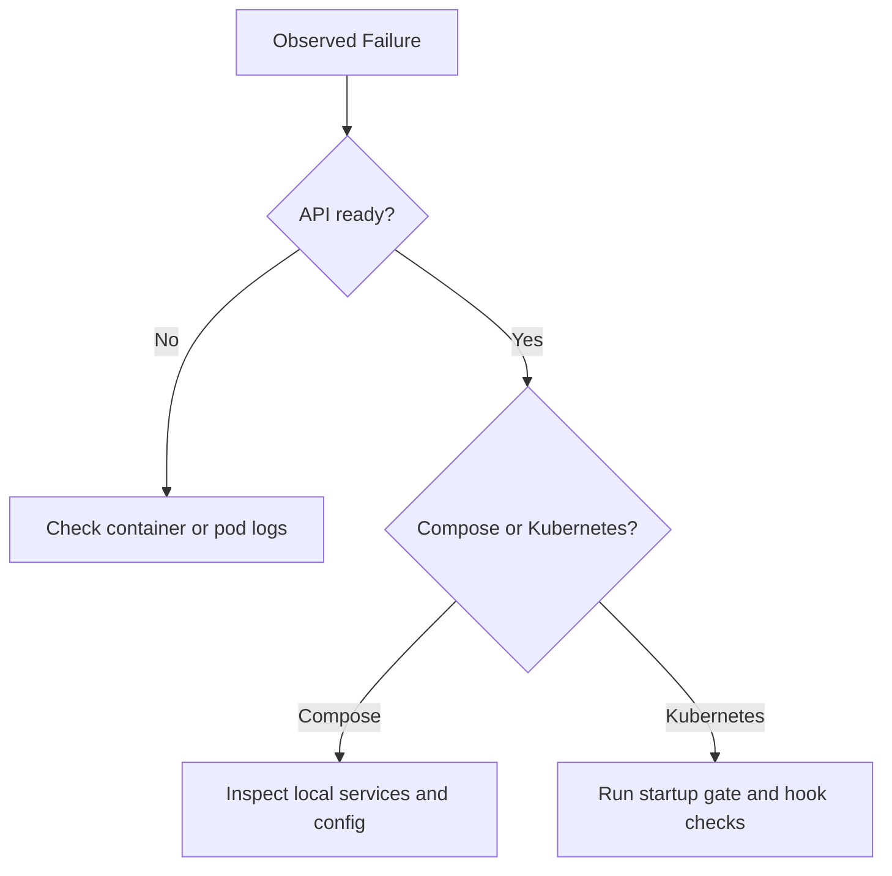

# Troubleshooting

## Triage Flow



## API not ready

Check logs:

```bash
docker compose -f docker/docker-compose.yml logs -f api
```

## Kubernetes: `poundcake-api` stuck in `Init` (`wait-stage-ready`)

Use this runbook to identify exactly which startup gate delayed API startup and whether the root cause is hook sequencing, endpoint readiness, or marker patching.

### Quick collector

Run the deterministic collector:

```bash
./helm/scripts/startup-gate-runbook.sh rackspace
```

Optional pod override:

```bash
./helm/scripts/startup-gate-runbook.sh rackspace poundcake-api-<pod-id>
```

The script prints a timeline summary and writes full artifacts under `/tmp/poundcake-startup-gate-*`.

### Manual triage steps

1. Capture init-gate waits with timestamps:

```bash
kubectl -n rackspace logs <poundcake-api-pod> -c wait-stage-ready --tail=300 --timestamps
```

Record first/last timestamps for:
- `wait-stage-ready-mariadb`
- `wait-stage-ready-stackstorm-bootstrap`
- `wait-stage-ready-st2-apikey`

2. Snapshot marker truth values and API key material:

```bash
kubectl -n rackspace get secret stackstorm-startup-markers -o jsonpath='{.data.poundcake_mariadb_ready}' | base64 -d; echo
kubectl -n rackspace get secret stackstorm-startup-markers -o jsonpath='{.data.stackstorm_bootstrap_ready}' | base64 -d; echo
kubectl -n rackspace get secret stackstorm-apikeys -o jsonpath='{.data.st2_api_key}' | base64 -d | wc -c
```

3. Correlate with startup hook job timing:

```bash
kubectl -n rackspace get jobs -o wide | egrep 'stackstorm-|poundcake-(mariadb-ready|bootstrap)'
kubectl -n rackspace describe job poundcake-mariadb-ready
kubectl -n rackspace logs job/poundcake-mariadb-ready --all-containers=true
```

4. Verify endpoint readiness used by `poundcake-mariadb-ready`:

```bash
kubectl -n rackspace get endpoints poundcake-mariadb -o yaml
```

Confirm `subsets[].addresses[]` is non-empty.

5. Build one rollout timeline table:

| Event | Observed time | Source |
|---|---|---|
| markers reset (`stackstorm-startup-markers-reset`) | | job |
| `stackstorm_bootstrap_ready=true` | | marker / `stackstorm-bootstrap` completion |
| `poundcake-mariadb-ready` start/complete | | job |
| `poundcake_mariadb_ready=true` | | marker / `wait-stage-ready` logs |
| `wait-stage-ready-mariadb` ready | | `wait-stage-ready` logs |
| api container start | | pod status |

### Root-cause classification

- `hook sequencing latency`: `poundcake-mariadb-ready` completes quickly after creation, but is created late in the hook sequence.
- `mariadb endpoint readiness latency`: `poundcake-mariadb-ready` is created promptly, but waits on `poundcake-mariadb` endpoints.
- `marker patch failure`: `poundcake-mariadb-ready` completes but `poundcake_mariadb_ready` remains `false`.

### Expected scenario outcomes

- Fresh install baseline: expect gate order `mariadb` -> `stackstorm-bootstrap` -> `st2-apikey`, then API starts.
- Upgrade with existing DB: expect `poundcake-mariadb-ready` to complete in seconds and reduced mariadb gate wait.
- Delayed StackStorm bootstrap: expect bootstrap marker gate to dominate, not mariadb marker.
- Missing/empty API key: expect `wait-stage-ready-st2-apikey` to block and `st2_api_key` length to be `0`.

## Alertmanager webhook returns 401

PoundCake requires `X-Internal-API-Key` for `/api/v1/webhook` when auth is enabled.

Get the key:

```bash
kubectl get secret poundcake-admin -n <namespace> -o jsonpath='{.data.internal-api-key}' | base64 -d
```

Confirm your Alertmanager receiver sends:

```yaml
http_config:
  headers:
    X-Internal-API-Key: "<internal-api-key>"
```

## Worker services return 401 when calling PoundCake API

Symptoms in logs:

- `chef ... status=401 ... Failed to fetch dishes`
- `prep-chef ... status=401 ... Failed to fetch new orders`
- `timer ... status=401 ... Failed to fetch dishes`
- `dishwasher ... status=401 ... Dishwasher sync failed`

When auth is enabled, workers must send `X-Internal-API-Key` for protected endpoints.

Verify the internal key in the admin secret:

```bash
kubectl get secret <release>-poundcake-admin -n <namespace> -o jsonpath='{.data.internal-api-key}' | base64 -d
```

Verify environment wiring:

```bash
kubectl get deploy <release>-poundcake-api -n <namespace> -o jsonpath='{.spec.template.spec.containers[0].env[?(@.name=="POUNDCAKE_AUTH_ENABLED")]}'
kubectl get deploy <release>-poundcake-api -n <namespace> -o jsonpath='{.spec.template.spec.containers[0].env[?(@.name=="POUNDCAKE_AUTH_INTERNAL_API_KEY")]}'
kubectl get deploy <release>-poundcake-chef -n <namespace> -o jsonpath='{.spec.template.spec.containers[0].env[?(@.name=="POUNDCAKE_INTERNAL_API_KEY")]}'
kubectl get deploy <release>-poundcake-prep-chef -n <namespace> -o jsonpath='{.spec.template.spec.containers[0].env[?(@.name=="POUNDCAKE_INTERNAL_API_KEY")]}'
kubectl get deploy <release>-poundcake-timer -n <namespace> -o jsonpath='{.spec.template.spec.containers[0].env[?(@.name=="POUNDCAKE_INTERNAL_API_KEY")]}'
kubectl get deploy <release>-poundcake-dishwasher -n <namespace> -o jsonpath='{.spec.template.spec.containers[0].env[?(@.name=="POUNDCAKE_INTERNAL_API_KEY")]}'
```

If Helm has `auth.enabled: false`, ensure API shows `POUNDCAKE_AUTH_ENABLED=false`.

After rollout, confirm 401 loops stop in worker logs.

## StackStorm API key errors

Delete and regenerate:

```bash
rm -f config/st2_api_key
docker compose -f docker/docker-compose.yml restart st2client
```

## Dishes stuck in processing

Check timer logs:

```bash
docker compose -f docker/docker-compose.yml logs -f timer
```

Confirm StackStorm execution exists:

```bash
docker compose -f docker/docker-compose.yml exec st2client st2 execution get <execution_id>
```

## No dishes created

Check prep-chef logs:

```bash
docker compose -f docker/docker-compose.yml logs -f prep-chef
```

## No workflow execution

Check chef logs:

```bash
docker compose -f docker/docker-compose.yml logs -f chef
```
