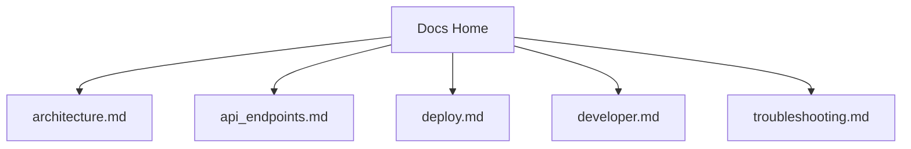

# PoundCake Documentation

Welcome to the PoundCake documentation site.

Use this site for local doc validation with MkDocs and for the GitHub Pages-published version of the project docs.

## Docs Map



## Start Here

- [Architecture](architecture.md)
- [API Endpoints](api_endpoints.md)
- [Deploy](deploy.md)
- [Developer Runbook](developer.md)
- [Troubleshooting](troubleshooting.md)

## Local Docs Workflow

Create and activate the repo virtual environment:

```bash
python3 -m venv .venv
source .venv/bin/activate
pip install --upgrade pip
pip install -r dev-requirements.txt
```

Serve the docs locally:

```bash
mkdocs serve
```

Build the site in strict mode:

```bash
mkdocs build --strict
```

The generated static site is written to `site/`.
