# poundcake Helm Chart

A standalone Helm chart for running PoundCake with StackStorm in Kubernetes. This chart is generated from the Docker Compose configuration and provides a production-ready deployment.

## Table of Contents

- [Features](#features)
- [Prerequisites](#prerequisites)
- [Installation](#installation)
- [Configuration](#configuration)
- [Upgrade](#upgrade)
- [Accessing Services](#accessing-services)
- [Troubleshooting](#troubleshooting)
- [Security](#security)
- [Architecture](#architecture)
- [Contributing](#contributing)

## Features

- **Deployment-ready baseline**: Includes probes, startup orchestration, and persistent storage
- **Security controls**: Explicit pod/container security contexts for infra, app, and startup utility containers
- **Maintenance-friendly**: Pod disruption budgets use `maxUnavailable: 1` for singleton deployments
- **Self-healing**: Liveness and readiness probes with proper timeouts
- **Startup orchestration**: Automated dependency management and initialization
- **Persistent storage**: Configurable PVCs for all data stores
- **Helm best practices**: Values schema, proper annotations, and metadata

## Prerequisites

- Kubernetes cluster v1.19 or higher
- Helm v3.0 or higher
- Helm unittest plugin (`helm plugin install https://github.com/helm-unittest/helm-unittest --version v0.5.1 --verify=false`)
- Persistent storage provisioner (dynamic or static)
- For production: Image registry with access to required images

## Installation

### Basic Installation

```bash
helm upgrade --install poundcake ./helm \
  --set poundcakeImage.repository=<your-repo/poundcake> \
  --set poundcakeImage.tag=<tag>
```

### Installation with Custom Values

```bash
helm upgrade --install poundcake ./helm \
  --set poundcakeImage.repository=your-registry.com/poundcake \
  --set poundcakeImage.tag=1.0.0 \
  --set secrets.dbRootPassword=your-strong-password \
  --set secrets.dbPassword=your-db-password
```

### Using Values File

Create a `values.yaml` file:

```yaml
poundcakeImage:
  repository: your-registry.com/poundcake
  tag: "1.0.0"

stackstormImage:
  repository: stackstorm/st2
  tag: "3.9.0"

secrets:
  dbRootPassword: "your-secure-root-password"
  dbPassword: "your-secure-db-password"
  st2AuthPassword: "your-secure-stackstorm-password"
```

Then install:

```bash
helm upgrade --install poundcake ./helm -f values.yaml
```

### Installing with Resource Limits

```bash
helm upgrade --install poundcake ./helm \
  --set defaultResources.requests.cpu=200m \
  --set defaultResources.requests.memory=256Mi \
  --set defaultResources.limits.cpu=1 \
  --set defaultResources.limits.memory=1Gi
```

### Startup Hooks and Wait Semantics

Startup orchestration uses Helm hook Jobs (`post-install,post-upgrade`) to set marker secrets.
Most workloads wait on those markers in init containers.

Because of that control flow, `--wait`/`--atomic` can deadlock before hook Jobs run.
Use the installer script defaults (non-waiting flow), or explicitly set:

```bash
POUNDCAKE_HELM_WAIT=false ./install/install-poundcake-helm.sh
```

If you intentionally need wait semantics, set `POUNDCAKE_ALLOW_HOOK_WAIT=true` in the same invocation.
Without that explicit override, the installer exits early to prevent hook deadlocks.

If a rollout is stuck with pods in `Init`, stop the command and re-run with wait disabled, then verify:

```bash
kubectl -n <namespace> get jobs
kubectl -n <namespace> get secret stackstorm-startup-markers -o yaml
```

By default, successful startup hook jobs are auto-cleaned (`hook-succeeded`) and failed jobs are retained for debugging.
You can tune this with `startupHooks.cleanup.*` values.
Init-gate logging is enabled by default and emits periodic progress lines for marker/endpoint waits.
Tune cadence and format with `startupHooks.gateLogging.enabled`, `startupHooks.gateLogging.intervalSeconds`, and `startupHooks.gateLogging.prefix`.

### Installer Validation and Preflight

`/Users/chris.breu/code/poundcake/helm/bin/install-poundcake.sh` supports installer-specific flags:

- `--validate`: run `helm lint` and `helm template --debug` before install
- `--skip-preflight`: skip dependency/cluster connectivity checks
- `--rotate-secrets`: delete known chart-managed secrets before install

Validation can also be enabled via `POUNDCAKE_HELM_VALIDATE=true`.
Current behavior is validate-then-install in the same run.

Default preflight checks verify required binaries and cluster access (`kubectl cluster-info`).

### Log Streaming Selectors

Pods and startup hook Jobs include cross-cutting log labels for one-command streaming during tests:

- `poundcake.io/log-group`
- `poundcake.io/log-subgroup`
- `poundcake.io/log-role`

Common selectors:

```bash
# PoundCake app pods
kubectl -n rackspace logs -f -l poundcake.io/log-group=poundcake --all-containers=true --prefix

# StackStorm API/auth edge plane
kubectl -n rackspace logs -f -l poundcake.io/log-group=stackstorm-edge --all-containers=true --prefix

# StackStorm execution plane
kubectl -n rackspace logs -f -l poundcake.io/log-group=stackstorm-exec --all-containers=true --prefix

# End-to-end test stream (PoundCake + StackStorm + startup hooks)
kubectl -n rackspace logs -f -l 'poundcake.io/log-group in (poundcake,stackstorm-edge,stackstorm-exec,startup-hooks)' --all-containers=true --prefix
```

### Private Registry Image Pulls (GHCR)

If your PoundCake image is private, use the installer env vars to create and wire a pull secret automatically:

```bash
source ./install/set-env-helper.sh
export HELM_REGISTRY_USERNAME="<gh-username>"
export HELM_REGISTRY_PASSWORD="<github_pat_with_read_packages>"
./install/install-poundcake-helm.sh
```

OCI chart authentication fallback chain:

- Username: `HELM_REGISTRY_USERNAME` -> `GHCR_USERNAME` -> `GITHUB_ACTOR`
- Password: `HELM_REGISTRY_PASSWORD` -> `GHCR_TOKEN` -> `CR_PAT` -> `GITHUB_TOKEN`

For pull-secret creation (`POUNDCAKE_CREATE_IMAGE_PULL_SECRET=true`), `HELM_REGISTRY_USERNAME` and
`HELM_REGISTRY_PASSWORD` must be set explicitly.

Installer controls:
- `POUNDCAKE_IMAGE_PULL_SECRET_NAME` (default: `ghcr-pull`)
- `POUNDCAKE_CREATE_IMAGE_PULL_SECRET` (default: `true`)
- `POUNDCAKE_IMAGE_PULL_SECRET_EMAIL` (default: `noreply@local`)
- `POUNDCAKE_IMAGE_PULL_SECRET_ENABLED` (default: `true`)

Chart pull-secret values:
- Canonical (PoundCake-only): `poundcakeImage.pullSecrets` (for PoundCake deployments and `poundcake-bootstrap` job)
- Legacy fallback (temporary): `imagePullSecrets`

Examples:
```bash
helm upgrade --install poundcake ./helm --set poundcakeImage.pullSecrets[0]=ghcr-pull
helm upgrade --install poundcake ./helm --set imagePullSecrets[0]=ghcr-pull
```

Troubleshooting GHCR 401:
- Verify PAT includes `read:packages`
- Verify package visibility/permissions allow the specified username
- Verify `poundcakeImage.repository` and `poundcakeImage.tag` point to an existing image
- Verify a PoundCake pod renders pull secret:
  `kubectl -n <namespace> get pod <poundcake-pod> -o jsonpath='{.spec.imagePullSecrets[*].name}'`

## Configuration

### Required Secrets

All secret values must be provided or they will be randomly generated:

- `secrets.dbRootPassword`: Root password for MariaDB
- `secrets.dbPassword`: Password for the poundcake database user
- `secrets.mongoRootPassword`: Root password for MongoDB
- `secrets.mongoPassword`: Password for the StackStorm MongoDB user
- `secrets.rabbitmqPassword`: Password for RabbitMQ
- `secrets.st2AuthPassword`: Password for StackStorm authentication

Secret ownership model:
- `poundcake-secrets` contains PoundCake app database credentials (`DB_*`) only.
- `stackstorm-secrets` is authoritative for StackStorm infra auth (`MONGO_*`, `RABBITMQ_*`, `ST2_AUTH_*`).
- Bakery database credentials are owned separately under Bakery-specific secret/config values (`bakery.database.*` and related secret refs).
- Redis is currently unauthenticated in this chart (no Redis password secret keys). If Redis auth is added later, store it in `stackstorm-secrets`.

Database ownership contract:
- PoundCake API and Bakery must use separate database names and credentials.
- When co-located in one namespace, PoundCake and Bakery can share one MariaDB server.
- Even on a shared server, PoundCake and Bakery must keep separate schema/database ownership and separate users.
- API migrations are API-owned; Bakery migrations are Bakery-owned and run by the Bakery DB init hook job.

Install model:
- `./install/install-bakery-helm.sh` installs Bakery only.
- `./install/install-poundcake-helm.sh` installs PoundCake only.
- `install-poundcake-helm.sh` no longer supports `--target`.
- `install-bakery-helm.sh` is the supported path for Bakery provider credentials and can verify/create secret-backed config for Rackspace Core, ServiceNow, Jira, GitHub, PagerDuty, Teams, and Discord, wiring `bakery.<provider>.existingSecret` automatically.

Co-located install order:
1. Install Bakery first in the namespace.
2. Install PoundCake second in the same namespace.
3. PoundCake installer auto-discovers Bakery URL and shared DB host, then enables:
`bakery.client.enabled=true`, `database.mode=shared_operator`, `database.sharedOperator.serverName=<discovered>`.
4. You can force explicit shared DB mode with `--shared-db-mode on --shared-db-server-name <server>`.

External Bakery mode (not co-located):
- Set `--remote-bakery-url` / `POUNDCAKE_REMOTE_BAKERY_URL`.
- Optional: `--remote-bakery-enabled`, `--remote-bakery-auth-mode`, `--remote-bakery-auth-secret`.
- If no Bakery URL is explicit and no Bakery is discovered in-namespace, PoundCake installer sets `bakery.client.enabled=false`.

Example:
```bash
./install/install-poundcake-helm.sh \
  --remote-bakery-url https://bakery.example.com \
  --remote-bakery-auth-mode hmac \
  --remote-bakery-auth-secret external-bakery-hmac
```

Readiness semantics:
- `/api/v1/live` is process-only.
- `/api/v1/ready` fails on blocking dependency outages.
- RabbitMQ management API auth degradation (for example HTTP 401) is non-blocking when AMQP (`5672`) is reachable.
- Redis connectivity remains readiness-blocking.

### Optional Configuration

#### Image Configuration

```yaml
poundcakeImage:
  repository: poundcake
  tag: latest
  pullPolicy: Always

uiImage:
  repository: poundcake-ui
  tag: latest
  pullPolicy: IfNotPresent
  containerPort: 8080

stackstormImage:
  repository: stackstorm/st2
  tag: "3.9.0"
  pullPolicy: IfNotPresent
```

Use immutable image pins for PoundCake releases. Set either a fixed tag or digest (`repository@sha256:...`) and avoid mutable `latest` in production installs.
Bakery image refs follow digest-first precedence as well: `bakery.image.digest` (or installer `POUNDCAKE_BAKERY_IMAGE_DIGEST` / `POUNDCAKE_IMAGE_DIGEST` fallback) overrides `bakery.image.tag`.

#### Persistence Configuration

```yaml
persistence:
  storageClassName: "gp3"
  mariadb:
    size: "10Gi"
  mongo:
    size: "10Gi"
  rabbitmq:
    size: "5Gi"
  redis:
    size: "2Gi"
```

Dynamic StackStorm pack propagation is RWO-safe by default. Pack content is served by PoundCake API and synchronized into each StackStorm pod via sidecar using `emptyDir`, so no shared RWX volume is required.
Greenfield installs require `/api/v1/cook/packs` to be available from `poundcake-api`.
Legacy compatibility endpoint `/api/v1/internal/stackstorm/pack.tgz` remains temporarily available.

```yaml
stackstormPackSync:
  enabled: true
  endpoint: "http://poundcake-api:8000/api/v1/cook/packs"
  pollIntervalSeconds: 20
  bootstrapPollIntervalSeconds: 5
  timeoutSeconds: 10
```

#### Service Configuration

```yaml
services:
  api:
    type: ClusterIP
    port: 8000
  ui:
    type: ClusterIP
    port: 80
  stackstormApi:
    type: ClusterIP
    port: 9101
```

The UI container listens on `uiImage.containerPort` (default `8080`) while the
Kubernetes Service exposes `services.ui.port` (default `80`) and maps it to the
internal container port.

#### Envoy Gateway Configuration

```yaml
gateway:
  enabled: true
  className: envoyproxy
  name: poundcake-gateway
  listeners:
    api:
      enabled: true
      hostname: poundcake.api.ord.cloudmunchers.net
      port: 443
      protocol: HTTPS
      tls:
        mode: Terminate
        secretName: poundcake-gw-tls-secret
      pathPrefix: /api
    ui:
      enabled: true
      hostname: poundcake.api.ord.cloudmunchers.net
      port: 443
      protocol: HTTPS
      tls:
        mode: Terminate
        secretName: poundcake-gw-tls-secret
      pathPrefix: /
```

If API and UI listeners use the same hostname, port, and protocol, the chart
renders a single Gateway listener and attaches both routes to it.

#### Pod Disruption Budgets

```yaml
pdb:
  enabled: true
```

#### Startup Hook Cleanup

```yaml
startupHooks:
  cleanup:
    enabled: true
    deleteSuccessful: true
    deleteFailed: false
```

#### Resource Limits

```yaml
defaultResources:
  requests:
    cpu: 100m
    memory: 128Mi
  limits:
    cpu: 500m
    memory: 512Mi
```

#### Pod Security Context

```yaml
podSecurityContext:
  runAsNonRoot: true
  fsGroup: 1000
  seccompProfile:
    type: RuntimeDefault
```

#### Infrastructure Container Security Context

```yaml
infraSecurityContext:
  mongodb:
    runAsNonRoot: true
    allowPrivilegeEscalation: false
    readOnlyRootFilesystem: false
```

MongoDB and other stateful infrastructure services default to `readOnlyRootFilesystem: false`
so they can create runtime socket/temp files (for example under `/tmp`).

#### App and Utility Container Security Context

```yaml
poundcakeImage:
  securityContext:
    allowPrivilegeEscalation: false
    readOnlyRootFilesystem: false
    capabilities:
      drop:
        - ALL

stackstormImage:
  securityContext:
    allowPrivilegeEscalation: false
    readOnlyRootFilesystem: false
    capabilities:
      drop:
        - ALL

utilitySecurityContext:
  runAsNonRoot: true
  runAsUser: 1000
  allowPrivilegeEscalation: false
  readOnlyRootFilesystem: false
  capabilities:
    drop:
      - ALL
```

App and startup utility containers default to writable root filesystems for runtime compatibility.
Hardened `readOnlyRootFilesystem: true` can be enabled per environment after validation.
StackStorm runtime config is rendered to `/tmp/st2/st2.conf` so services can run without writing to `/etc`.
Utility and infrastructure containers also set explicit non-root UID defaults to satisfy `runAsNonRoot` admission checks.

### Complete Values Reference

See [values.schema.json](values.schema.json) for a complete schema and documentation.

## Upgrade

### Upgrading to a New Version

```bash
helm upgrade poundcake ./helm \
  --set poundcakeImage.tag=1.1.0 \
  --set stackstormImage.tag="3.10.0"
```

### Backing Up Before Upgrade

```bash
# Backup secrets
kubectl get secret -n <namespace> -l app.kubernetes.io/instance=poundcake -o yaml > secrets-backup.yaml

# Backup PVCs
kubectl get pvc -n <namespace> -l app.kubernetes.io/instance=poundcake -o yaml > pvc-backup.yaml
```

## Accessing Services

### Internal Cluster Access

```bash
# PoundCake API
kubectl port-forward -n <namespace> svc/poundcake-api 8000:8000

# StackStorm API
kubectl port-forward -n <namespace> svc/stackstorm-api 9101:9101

# StackStorm Web UI
kubectl port-forward -n <namespace> svc/stackstorm-web 8080:8080
```

### Service Endpoints

- **PoundCake API**: `http://poundcake-api:8000`
- **StackStorm API**: `http://stackstorm-api:9101`
- **StackStorm Auth**: `http://stackstorm-auth:9100`
- **StackStorm Stream**: `http://stackstorm-stream:9102`
- **StackStorm Web UI**: `http://stackstorm-web:8080`

### External Access

For external access, create an Ingress resource:

```yaml
apiVersion: networking.k8s.io/v1
kind: Ingress
metadata:
  name: poundcake-ingress
  namespace: poundcake
spec:
  rules:
  - host: poundcake.example.com
    http:
      paths:
      - path: /
        pathType: Prefix
        backend:
          service:
            name: poundcake-api
            port:
              number: 8000
```

Or enable the built-in Gateway API resources (for Envoy Gateway):

```yaml
gateway:
  enabled: true
  className: envoyproxy
```

## Troubleshooting

### Check Pod Status

```bash
kubectl get pods -n <namespace> -l app.kubernetes.io/instance=poundcake
kubectl describe pod <pod-name> -n <namespace>
```

### Check Service Status

```bash
kubectl get services -n <namespace> -l app.kubernetes.io/instance=poundcake
kubectl get endpoints -n <namespace> -l app.kubernetes.io/instance=poundcake
```

### View Logs

```bash
# PoundCake API
kubectl logs -n <namespace> -l app.kubernetes.io/component=api --tail=100

# StackStorm Services
kubectl logs -n <namespace> -l app.kubernetes.io/component=stackstorm-api --tail=100

# All Services
kubectl logs -n <namespace> -l app.kubernetes.io/instance=poundcake --tail=100 -f
```

### Common Issues

#### RabbitMQ Readiness Probe Failing

If you see the RabbitMQ readiness probe timeout issue:

```bash
# Check RabbitMQ logs
kubectl logs -n <namespace> -l app.kubernetes.io/component=stackstorm-rabbitmq

# Verify RabbitMQ is accessible
kubectl exec -n <namespace> -it $(kubectl get pod -n <namespace> -l app.kubernetes.io/component=stackstorm-rabbitmq -o name) -- rabbitmq-diagnostics ping
```

#### Secret Generation Issues

If secrets are not being generated properly:

```bash
# Check secret contents
kubectl get secret -n <namespace> poundcake-secrets -o jsonpath='{.data}' | base64 -d

# Manually set secrets
kubectl create secret generic poundcake-secrets \
  --from-literal=DB_ROOT_PASSWORD=your-password \
  --from-literal=DB_PASSWORD=your-password \
  --namespace <namespace>
```

#### Startup Jobs Stuck

Check the startup jobs:

```bash
# Check job status
kubectl get jobs -n <namespace> -l app.kubernetes.io/instance=poundcake

# View job logs
kubectl logs -n <namespace> <job-name>
```

### Debug Mode

Enable debug logging:

```bash
helm upgrade --install poundcake ./helm \
  --set logFormat=json \
  --set poundcakeImage.tag=1.1.0 \
  --set stackstormImage.tag=3.9.0
```

## Security

### Security Features

- **Explicit container security contexts**: Applied to infrastructure, PoundCake, StackStorm, and startup utility containers
- **Capability dropping**: Default security profiles drop all Linux capabilities
- **Writable-root compatibility defaults**: `readOnlyRootFilesystem: false` by default for stateful/scripted workloads
- **Secret management**: All sensitive data stored in Kubernetes Secrets
- **Pod security context**: Default pod security context is applied across deployments and startup jobs
- **Seccomp profile**: Runtime default seccomp profile is configured

### Recommended Security Practices

1. Use strong, unique passwords for all secrets
2. Enable image pull secrets for private registries
3. Regularly rotate credentials
4. Keep images updated with security patches
5. Enforce Kubernetes Pod Security Standards in the target namespace
6. Use network policies to restrict traffic

### Secret Management

For production, consider using external secret managers:

- HashiCorp Vault
- AWS Secrets Manager
- Azure Key Vault
- GCP Secret Manager

## Architecture

### Components

#### Datastores
- **MariaDB**: Database for PoundCake
- **Bakery MariaDB/DB**: Database for Bakery (standalone or alongside mode)
- **MongoDB**: Database for StackStorm
- **RabbitMQ**: Message broker
- **Redis**: Caching and session storage

#### PoundCake Services
- **api**: Main API service
- **chef**: Chef orchestration
- **prep-chef**: Pre-chef orchestration
- **timer**: Timer service
- **dishwasher**: Cleanup service

#### StackStorm Services
- **stackstorm-api**: API server
- **stackstorm-auth**: Authentication service
- **stackstorm-actionrunner**: Action execution
- **stackstorm-stream**: Stream processing
- **stackstorm-web**: Web interface
- And other StackStorm components

#### Reduced StackStorm Profile (Default)
- Enabled by default: `mongodb`, `rabbitmq`, `redis`, `auth`, `api`, `actionrunner`, `rulesengine`, `workflowengine`, `scheduler`, `garbagecollector`, `client`
- Disabled by default: `notifier`, `timersengine`, `sensorcontainer`, `register`, `stream`, `web`
- Effects of reduced defaults:
- No sensor-driven triggers
- No timer engine processing
- No notifier processing

To re-enable the disabled StackStorm services:

```yaml
stackstormServices:
  notifier:
    enabled: true
  timersengine:
    enabled: true
  sensorcontainer:
    enabled: true
  register:
    enabled: true
  stream:
    enabled: true
  web:
    enabled: true
```

StackStorm auth credentials are now single-source-of-truth:
- `secrets.st2AuthUser` and `secrets.st2AuthPassword` drive both bootstrap login and the auth backend htpasswd entry.
- The htpasswd entry is generated as bcrypt during chart render to avoid drift with static files.

### Startup Order

The chart uses Helm hooks to ensure proper startup order:

1. Reset startup markers
2. Create MongoDB user
3. Wait for infrastructure (endpoints)
4. Mark StackStorm control plane ready (auth + api availability)
5. Wait for workers
6. Wait for edge services
7. Run StackStorm bootstrap
8. Wait for MariaDB
9. Run PoundCake bootstrap

PoundCake bootstrap catalog behavior:
- During `poundcake-bootstrap`, Dishwasher sync reads bootstrap Bakery ingredients from `/app/bootstrap/ingredients/bakery.yaml`.
- During `poundcake-bootstrap`, Dishwasher sync reads bootstrap recipe catalog entries from `/app/bootstrap/recipes`.
- Override file path with `POUNDCAKE_BOOTSTRAP_INGREDIENTS_FILE`.
- Override recipes directory with `POUNDCAKE_BOOTSTRAP_RECIPES_DIR`.

#### Gate Flow Diagram

```mermaid
flowchart LR
  A["stackstorm-startup-markers-reset<br/>sets all markers=false"] --> B["stackstorm-mongodb-user-sync"]
  B -->|set stackstorm_mongodb_user_ready=true| C["stackstorm-infra-ready"]
  C -->|set stackstorm_infra_ready=true| D["Stage 2 deploys<br/>stackstorm-register/auth/api wait-stage2"]
  D --> E["stackstorm-controlplane-ready"]
  E -->|set stackstorm_controlplane_ready=true| F["Stage 4 deploys<br/>worker services wait-stage4"]
  F --> G["stackstorm-workers-ready"]
  G -->|set stackstorm_workers_ready=true| H["Stage 5 deploys<br/>edge services wait-stage5"]
  H --> I["stackstorm-edge-ready"]
  I -->|set stackstorm_edge_ready=true| J["stackstorm-bootstrap"]
  J -->|set stackstorm_bootstrap_ready=true| K["poundcake-mariadb-ready"]
  K -->|set poundcake_mariadb_ready=true| L["poundcake-bootstrap"]
  L -->|set poundcake_bootstrap_ready=true| M["PoundCake runtime<br/>chef/prep-chef/timer/dishwasher/ui"]

  N["Optional waits are conditional on<br/>stackstormServices.*.enabled<br/>(notifier/timersengine/sensorcontainer/stream/web)"]
  N -.-> G
  N -.-> I
```



Hook cleanup behavior:
- Successful startup jobs are removed automatically after completion.
- Failed startup jobs are retained by default for troubleshooting.

Docker Compose gate flow is documented in the top-level README Docker section (`/Users/chris.breu/code/poundcake/README.md`).

One-time cleanup for existing completed startup jobs:

```bash
kubectl -n <namespace> get jobs \
  -o jsonpath='{range .items[?(@.status.succeeded==1)]}{.metadata.name}{"\n"}{end}' \
  | grep -E '^(stackstorm-.*ready|stackstorm-mongodb-user-sync|stackstorm-startup-markers-reset|stackstorm-bootstrap|poundcake-.*)$' \
  | xargs -r -I{} kubectl -n <namespace> delete job {}
kubectl -n <namespace> get jobs,pods
```

## Contributing

### Development

1. Fork the repository
2. Create a feature branch
3. Make your changes
4. Test the chart:
   ```bash
   helm lint ./helm
   helm template poundcake ./helm > /dev/null
   ```
5. Submit a pull request

### Testing

Run chart tests:

```bash
# Lint the chart
helm lint ./helm

# Run helm-unittest suites
helm unittest ./helm --file 'tests/unittest/*_test.yaml'

# Validate schema
helm show values ./helm | jq . > test-values.yaml
helm install test ./helm -f test-values.yaml --dry-run

# Run local smoke tests
make test
```

### Code Style

- Follow Helm chart best practices
- Use proper error handling
- Add comments for complex logic
- Update documentation for changes

## License

[Your License Here]

## Support

- Documentation: [Your Docs URL]
- Issues: [GitHub Issues URL]
- Email: support@example.com

## Version History

- **0.1.0**: Initial production-ready release
  - Added security contexts
  - Improved probe configurations
  - Added pod disruption budgets
  - Implemented values schema
  - Enhanced documentation
