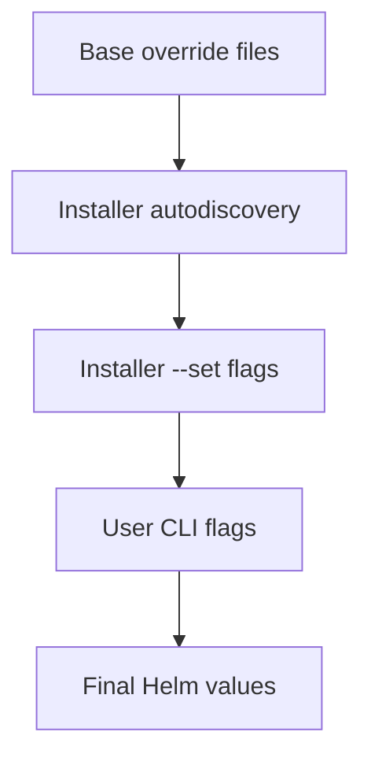

# Helm Overrides

This directory stores example override files for Helm installs.

## Override Precedence



Canonical image keys for overrides:
- `poundcakeImage.repository` / `poundcakeImage.tag`
- `uiImage.repository` / `uiImage.tag`
- `bakery.image.repository` / `bakery.image.tag`

Base example source in-repo:
- `helm/base-overrides/poundcake-helm-overrides-examples.yaml`
  (copy/merge into `/etc/genestack/helm-configs/poundcake/poundcake-helm-overrides.yaml`)

Service selection in overrides now uses explicit booleans:
- `poundcake.enabled` (PoundCake + StackStorm resources)
- `bakery.enabled` (Bakery resources)

Installer mapping:
- `./install/install-poundcake-helm.sh` => `poundcake.enabled=true`, `bakery.enabled=false`
- `./install/install-bakery-helm.sh` => `poundcake.enabled=false`, `bakery.enabled=true`
- For co-located deployments in one namespace: install Bakery first, then PoundCake.

Precedence note:
- installer-emitted `--set` booleans are appended after auto-discovered `-f` files (`POUNDCAKE_BASE_OVERRIDES`, global/service override dirs), so installer defaults can override `poundcake.enabled` and `bakery.enabled` from those files.
- user-supplied CLI flags passed after the installer command (for example `-f`, `--set`, `--set-string`) are appended last and can override installer defaults.

## Enable HA

1. Copy the HA example to the Genestack PoundCake overrides path:

```bash
sudo mkdir -p /etc/genestack/helm-configs/poundcake
sudo cp helm/overrides/ha-overrides.yaml /etc/genestack/helm-configs/poundcake/poundcake-helm-overrides.yaml
```

2. Run the Helm installer:

```bash
./install/install-poundcake-helm.sh
```

The installer will automatically include:

- `/opt/genestack/base-helm-configs/poundcake/poundcake-helm-overrides.yaml`
- `/etc/genestack/helm-configs/global_overrides/*.yaml`
- `/etc/genestack/helm-configs/poundcake/*.yaml`
- kustomize post-renderer from `/etc/genestack/kustomize` (when present)

## Verify

```bash
kubectl -n rackspace get deploy poundcake poundcake-chef poundcake-timer poundcake-dishwasher
kubectl -n rackspace get svc poundcake
```

## Enable Envoy Gateway Route/Listener (Kronos)

Use the provided Kronos Gateway override to create/update:
- Gateway listener on `HTTPS`/`443`
- HTTPRoute for `poundcake.api.kronos.cloudmunchers.net`

1. Review and adjust gateway object names/namespace and TLS secret:

```bash
cat helm/overrides/gateway-kronos-overrides.yaml
```

2. Copy into the active Genestack PoundCake override path:

```bash
sudo mkdir -p /etc/genestack/helm-configs/poundcake
sudo cp helm/overrides/gateway-kronos-overrides.yaml /etc/genestack/helm-configs/poundcake/poundcake-helm-overrides.yaml
```

3. Install/upgrade:

```bash
./install/install-poundcake-helm.sh
```
